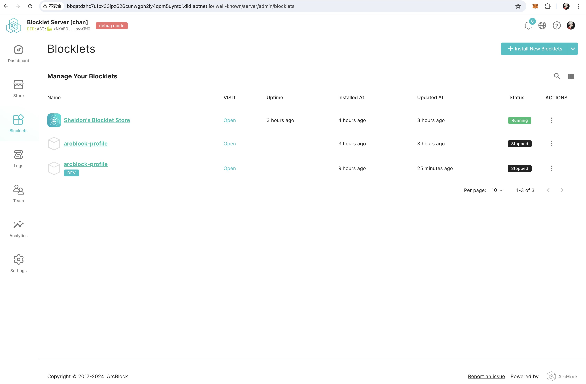
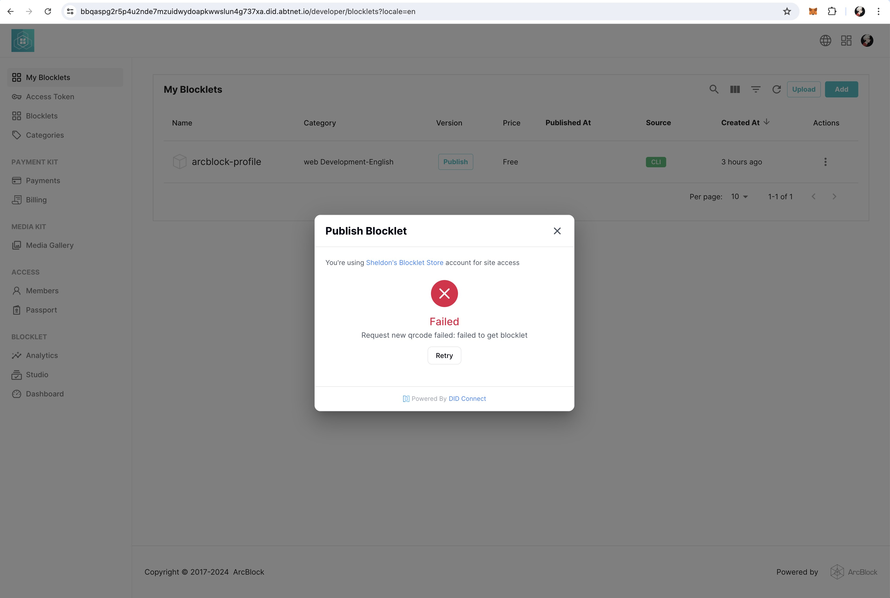

# Blocklet 做的个人信息编辑

## 用 blocklet create 创建项目
根据文档使用 `blocklet create` 指令创建项目。

## 使用 DID Wallet 进行登录授权
通过 `session.login()` 调用 DID Wallet 进行登录授权

## 简单的用户信息编辑
手机号码做了简单的正则校验，` + ` 和数字空格组合。
邮箱同样做了简单校验。

## 本地正常 bundle，deploy，local store 上传正常，无法发布
本地可正常 bundle，deploy

local store 发布应用时钱包二维码无法获取。

